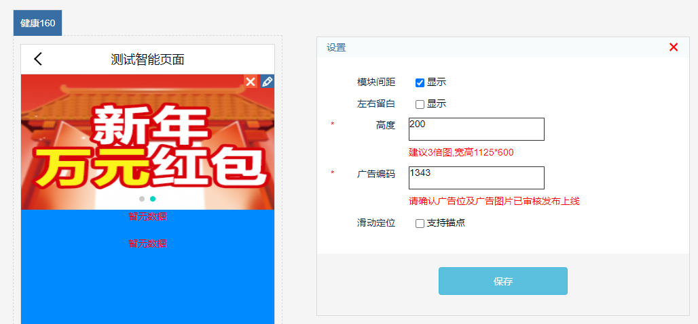
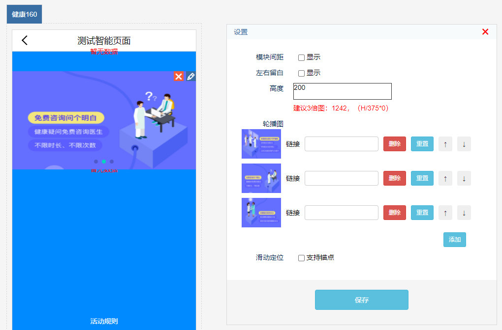
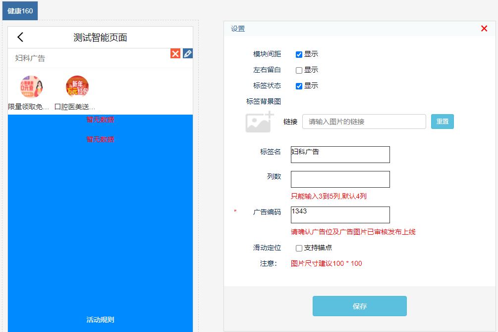
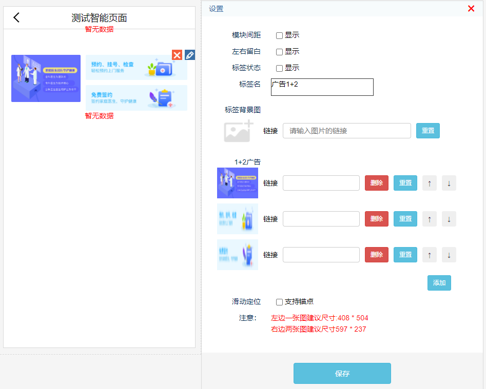
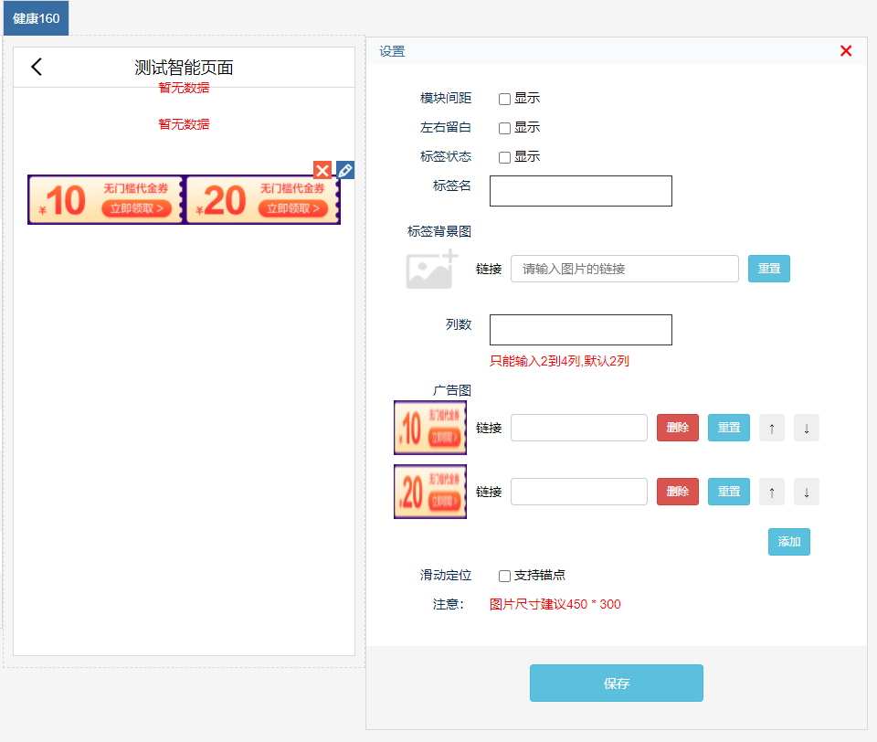
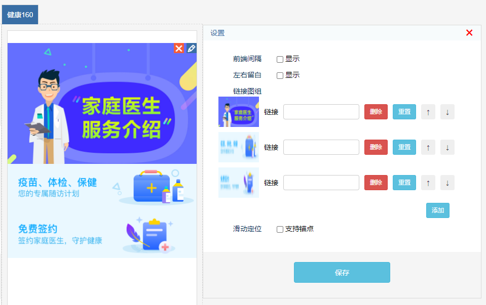
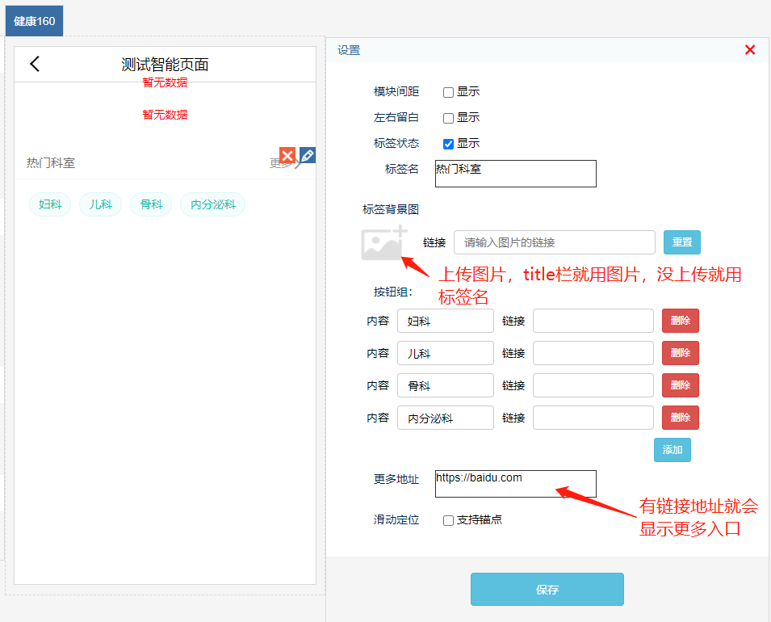
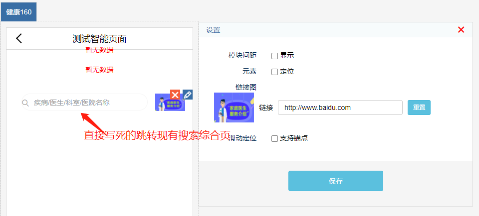
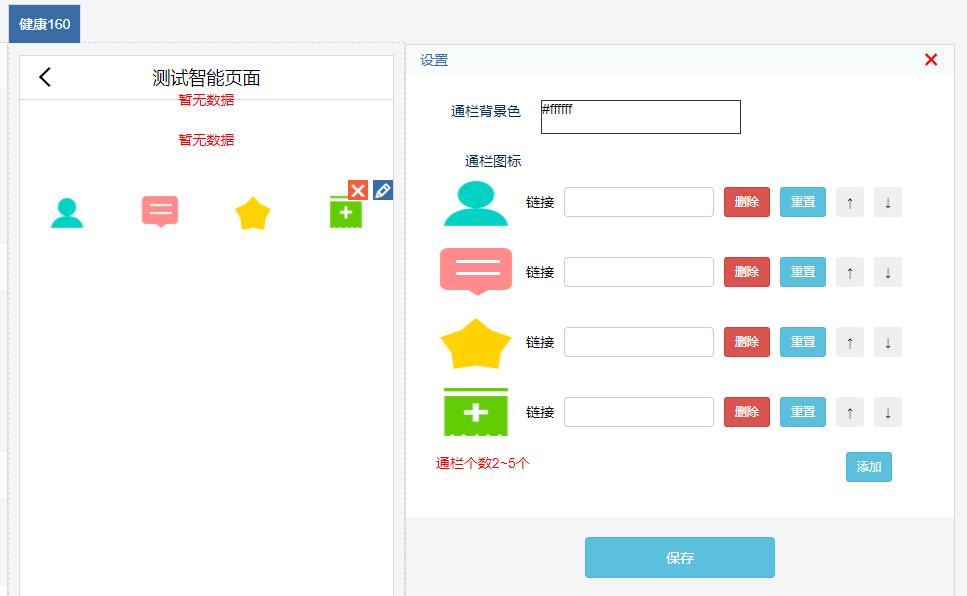

# 广告组件

## 轮播图

### 线上数据获取

**1、通过输入线上已有广告id直接获取数据**

### 直接上传
**2、通过手动上传广告图片及链接**

## 广告框

### 一行多列icon+文字

**1、通过输入线上已有广告id直接获取数据，icon+文字，一行3/4/5列 默认4列**

### 1+2
**2、可配置1+2广告纯图片广告**

### 一行多列纯图广告
**3、可配置2/3/4列纯图片广告**

### 一列多行纯图广告
**4、从上往下纯图片广告展示**

## 内容框

**1、文字button广告**

## tab栏

## 搜索框

**左侧搜索栏写死文字样式和链接，跳转现有搜索首页，只有右侧广告位可配置**

## 底部通栏菜单

**固定在页面底部支持2-5个菜单纯图片广告配置**
